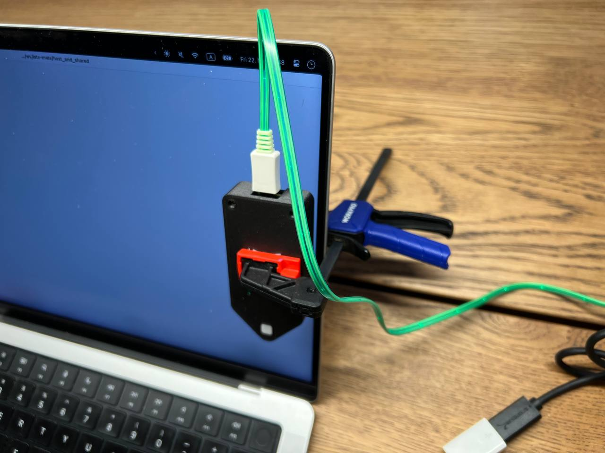
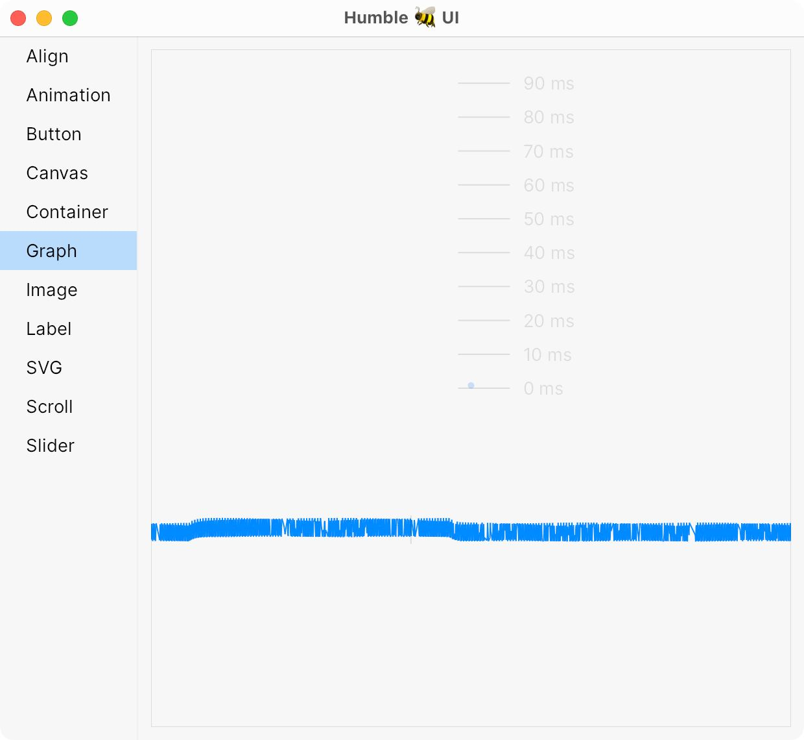

Update 003 — Houston, we have results!
---

Last week Dan sent me the PCB, and with a little soldering, we got our first prototype. It measures!

Our typical setup looks like this:

In fact, that clamp turned out to be a very convenient way to mount Late Mate. We are now thinking about whether we should include it in the package (maybe not).

Now, we take an app, like Kitty. Increase font size to some unreasonable size (for now, I hope you won’t need to do that).

Then we make our device pretend it’s a keyboard and produce USB events. It first “types” Spacebar and then Backspace:

Then we position Late Mate Prototype Mark I (tm) measuring device on top of it:

And we observe the brightness change. This gets us a graph like this:

 

Isn’t it beautiful? How smooth this curve is?

Don’t mind the UI, it’s a temporary quick-and-dirty tool (still better than Google Sheets) to analyze the raw stream of numbers coming from the device.

Here, let me annotate it for you:

 

Already, we can say a few things:

- Delay between keypress and photons changing their intensity on a screen is about 42..44 ms for this particular case.
- LCD screen can’t change brightness immediately. It takes time, for this monitor about 16-17 ms actually, to go from black to white.

For funsies, I can turn on “Fast” response mode in the display’s settings and we can see how it starts to “overshoot”:

Without improving latency much. Gives you a hell lot of artifacts, though. But now I can see them with science!

From here, we just do it a bunch of times, like 100, and we get a latency distribution graph! Like this:

From it you can tell that a combination of Kitty and Dell U3224KB react to keypress from 33 to 53 ms, averaging at 43 ms.

This is full end-to-end, so it includes USB polling, app code, drawing, compositor, GPU buffering, and even LCD switch times. But it’s also the latency you care about the most because that’s what your body and your brain actually experience.

Now to the actual results. We did a bunch of measurements and this is what we found (click to enlarge):

Interesting observations:

- 120 Hz (Macbook Pro) doesn’t improve end-to-end latency that much. Maybe by 5-10 ms. Sounds good in isolation, but when you see that total latency starts at 40 ms, it only gives you around 20%...

- Latency at the top and the bottom of the screen differ significantly! For my screen, it’s ~10-15 ms! So instead of buying a 120 Hz screen, just move all your windows closer to the top :)

- Zed is not as fast as they [claim to be](https://twitter.com/nikitonsky/status/1771622685665116440). In typing latency, it’s closer to VS Code than to Sublime Text.

- Apple Terminal has two peaks about 40 ms apart. The reasons for that are unknown.

Another thing we learned is that the Macbook Pro's built-in XDR Display seems to modulate brightness. It’s not as smooth and constant as I get on my Dell, instead, it’s going up and down roughly every ms:

Amplitude becomes smaller when you push brightness higher. The picture above was at ~400 nits, below is the full 1600 nits:

But of course, you don’t run UI at 1600 nits. That presents us with a bit of a problem: how do you find a signal if your noise is like this:

(it’s hard to see but there’s a keypress in there).

Well, it can only mean one thing: we have something to work on! Subscribe for even more unexplainable results!

Bye-e!